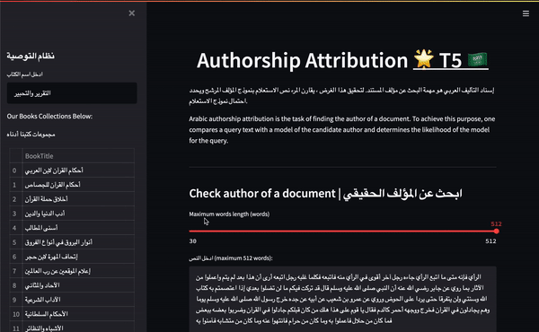

# Authorship Attribution For Arabic Books Using Deep Learning

The objective of this project is to investigate application of Deep Learning algorithms for arabic authorship attribution. Authorship attribution refers to the process of identifying the writer of a piece of text as input.

Online Now :[With Arabic Books Recommnder](https://share.streamlit.io/a-safarji/books-recommnder-/main/basedon_user.py)

<iframe src="https://streamable.com/e/7kjspy" frameborder="0" width="100%" height="100%" allowfullscreen style="width:100%;height:100%;position:absolute;left:0px;top:0px;overflow:hidden;"></iframe>

[Watch the video](https://drive.google.com/drive/u/0/folders/1QfvjLwup6PYQh2LEWoqIveQiRlIDdkLW)

<video src='https://drive.google.com/file/d/1RG8PFala8O1dThhVKejROkskHAJE-PRX/view?usp=sharing' width=180/>

